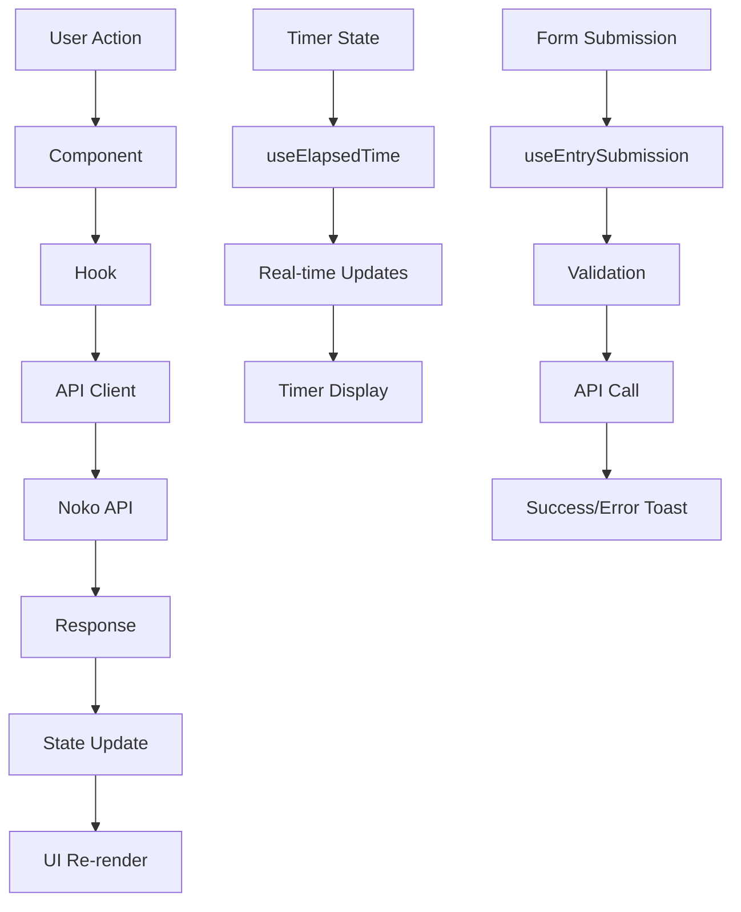

# Noko Time Tracking for Raycast

> [!WARNING]
> This Raycast plugin is not an official tracking tool provided by [Noko Time Tracking](https://nokotime.com).

A powerful Raycast extension for managing your Noko time tracking directly from your command palette. Track time, manage projects, and view entries with a unified, optimized interface.

## ✨ Features

### 🎯 **Unified Timer Management**

- **Single Command Interface** - All timer operations in one place
- **Real-time Updates** - Live elapsed time display for running timers
- **Smart Sorting** - Running timers first, then paused, then inactive projects
- **Project-based Organization** - Each project shows its current timer status

### ⏱️ **Timer Controls**

- **Start Timer** - Begin tracking time on any project
- **Pause/Resume** - Pause timers while preserving elapsed time
- **Log Timer** - Save timer as time entry with description
- **Discard Timer** - Cancel timer without saving time

### 📝 **Time Entry Management**

- **Quick Entry Creation** - Add manual time entries with project selection
- **Smart Defaults** - Auto-populate with project billing increments
- **Flexible Time Input** - Support for both "h:mm" format and minutes
- **Tag Support** - Add tags to entries for better organization
- **Entry History** - View and filter recent entries by date

### 🎨 **Enhanced User Experience**

- **Error Boundaries** - Graceful error handling with user-friendly messages
- **Loading States** - Clear feedback during API operations
- **Toast Notifications** - Success/error feedback for all actions
- **Keyboard Shortcuts** - Quick access to common actions
- **Detail Views** - Expandable project and entry information

## 🏗️ Architecture

### **Component Structure**

```
src/
├── components/           # UI Components
│   ├── TimerItem.tsx    # Individual timer/project item
│   ├── EntryItem.tsx    # Individual entry display
│   ├── ErrorBoundary.tsx # Error handling wrapper
│   └── LoadingState.tsx # Loading state component
├── views/               # View Components
│   ├── TimersView.tsx   # Main timers list view
│   ├── EntriesView.tsx  # Entries list with filtering
│   └── AddEntryView.tsx # Time entry creation form
├── hooks/               # Custom React Hooks
│   ├── useApiData.ts    # Data fetching and caching
│   ├── useTimerActions.ts # Timer control actions
│   ├── useElapsedTime.ts # Real-time timer updates
│   ├── useEntrySubmission.ts # Entry form handling
│   ├── useEntries.ts    # Entry filtering logic
│   └── useDetailToggle.ts # Detail view toggle
├── lib/                 # Shared Utilities
│   └── api-client.ts    # Centralized API client
├── types.ts             # TypeScript type definitions
├── constants.ts         # Application constants
├── utils.ts             # Utility functions
└── timers.tsx           # Main command entry point
```

### **Data Flow Diagram**



## 🚀 Getting Started

### Prerequisites

- [Raycast](https://raycast.com/) installed on your Mac
- Noko account with API access
- Node.js 16+ for development

### Installation

1. **Clone the repository**

   ```bash
   git clone https://github.com/JuanVqz/noko-for-raycast.git
   cd noko-for-raycast
   ```

2. **Install dependencies**

   ```bash
   npm install
   ```

3. **Configure API access**

   - Get your Personal Access Token from Noko
   - Open Raycast preferences
   - Navigate to Extensions → Noko
   - Enter your Personal Access Token
   - Select your timezone (optional, defaults to system timezone)

4. **Start using the extension**
   - Open Raycast (`Cmd + Space`)
   - Type "Timers" to access the extension
   - Start tracking your time!

## 📖 Usage Guide

### **Main Commands**

- **`Timers`** - Access the main timer management interface (single command with multiple views)

### **Timer Operations**

- **Start Timer**: Click on any project to begin tracking
- **Pause Timer**: Pause while preserving elapsed time
- **Resume Timer**: Continue from where you left off
- **Log Timer**: Save timer as time entry (opens form)
- **Discard Timer**: Cancel without saving (destructive action)

### **Time Entry Creation**

- **Manual Entry**: Use "Add Entry" action to create entries manually
- **From Timer**: Use "Log Timer" to convert running/paused timer to entry
- **Time Format**: Enter time as "1:30" (hours:minutes) or "90" (minutes)
- **Smart Defaults**: Form auto-populates with project billing increments

### **Entry Management**

- **View Entries**: Access recent entries with date filtering
- **Filter by Date**: Today, Yesterday, Tomorrow options
- **Entry Details**: Expand entries to see full information

### **Keyboard Shortcuts**

- `Cmd + D` - Toggle detail view (in entries view)
- `Shift + Cmd + Enter` - Cancel/Back to timers (from entries/add entry views)

## 📚 Documentation

- **[Development Guide](docs/development.md)** - Complete setup and development instructions
- **[API Reference](docs/API.md)** - Detailed API integration documentation
- **[Contributing Guide](docs/CONTRIBUTING.md)** - How to contribute to the project
- **[Troubleshooting](docs/TROUBLESHOOTING.md)** - Common issues and solutions

## 🔧 Development

See [Development Guide](docs/development.md) for detailed setup instructions.

## 📋 Requirements

To use this plugin, you will need a **Personal Access Token (PAT)** from Noko. If you do not have a PAT, please follow these steps:

1. Log in to your Noko account.
2. Click on **Integration & Apps**.
3. Generate your Personal Access Token.

### System Requirements

- **macOS** 10.15+ (Catalina or later)
- **Raycast** 1.0+
- **Noko Account** with API access
- **Personal Access Token** from Noko settings

## 🤝 Contributing

We welcome contributions! Please see our [Contributing Guide](docs/CONTRIBUTING.md) for details on how to get started.

## 🆘 Support

- **Issues**: [GitHub Issues](https://github.com/JuanVqz/noko-for-raycast/issues)
- **Discussions**: [GitHub Discussions](https://github.com/JuanVqz/noko-for-raycast/discussions)
- **Troubleshooting**: [Troubleshooting Guide](docs/TROUBLESHOOTING.md)

## 📄 License

This project is licensed under the MIT License - see the [LICENSE](LICENSE) file for details.

## 🙏 Acknowledgments

- [Raycast](https://raycast.com/) for the amazing developer platform
- [Noko](https://nokotime.com/) for the time tracking API
- The open-source community for inspiration and tools
