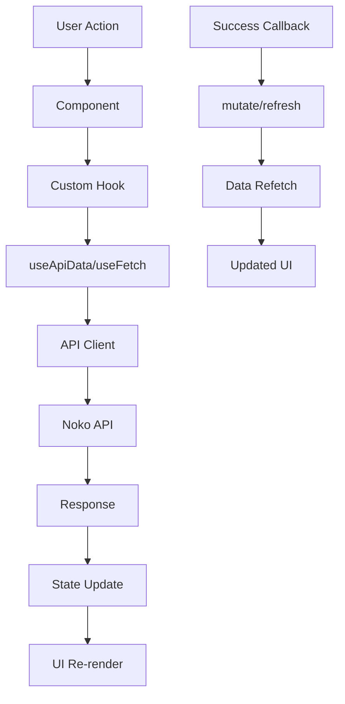

# API Reference

This document provides detailed information about the Noko API integration and the extension's API client.

## 🔗 Noko API Integration

The extension integrates with the [Noko Time Tracking API v2](https://developer.nokotime.com/) to provide seamless time tracking functionality.

### Base URL

```
https://api.nokotime.com/v2
```

### Authentication

All API requests require a Personal Access Token (PAT) in the header:

```
X-NokoToken: your_personal_access_token
```

## 📡 API Endpoints Used

### Projects

- **GET** `/projects?enabled=true` - Fetch enabled projects
- **GET** `/projects/{id}/timer/start` - Start timer for project
- **PUT** `/projects/{id}/timer/start` - Start timer for project
- **PUT** `/projects/{id}/timer` - Pause/stop timer
- **DELETE** `/projects/{id}/timer` - Discard timer
- **PUT** `/projects/{id}/timer/log` - Log timer as entry

### Timers

- **GET** `/timers` - Fetch all active timers

### Entries

- **GET** `/current_user/entries?from={date}&to={date}` - Fetch user entries for date range
- **POST** `/entries` - Create new time entry

### Tags

- **GET** `/tags` - Fetch all available tags

## 🏗️ API Client Architecture

### Centralized API Client (`src/lib/api-client.ts`)

The extension uses a centralized API client that provides:

- **Consistent error handling**
- **Automatic response parsing**
- **Type-safe API calls**
- **Centralized configuration**

```typescript
class ApiClient {
  // HTTP methods with consistent error handling
  async get<T>(endpoint: string): Promise<ApiResponse<T>>;
  async post<T>(endpoint: string, data?: any): Promise<ApiResponse<T>>;
  async put<T>(endpoint: string, data?: any): Promise<ApiResponse<T>>;
  async delete<T>(endpoint: string): Promise<ApiResponse<T>>;
}
```

### Response Format

All API responses follow a consistent format:

```typescript
interface ApiResponse<T> {
  data?: T;
  error?: string;
  success: boolean;
}
```

## 🔄 Data Flow

### 1. Data Fetching Architecture

The extension uses a layered approach for data fetching:

```typescript
// Generic API data hook (useApiData)
export function useApiData<T>(endpoint: string, options?: {
  enabled?: boolean;
  keepPreviousData?: boolean;
}) {
  return useFetch<T>(absoluteUrl, {
    headers: apiClient.headers,
    keepPreviousData,
    execute: enabled,
  });
}

// Specialized hooks for specific data types
const { data: projects, isLoading } = useProjects();
const { data: timers, mutate: refreshTimers } = useTimers();
const { data: entries } = useEntries(dateFilter);
```

### 2. Real-time Timer Updates

```typescript
// Timer state management with real-time updates
const { startTimer, pauseTimer, logTimer } = useTimerActions({
  onSuccess: () => refreshTimers(), // Triggers data refresh
  onError: (error) => showError(error),
});

// Real-time elapsed time calculation
const elapsedTime = useElapsedTime(timer); // Updates every second for running timers
```

### 3. Form Submissions & State Management

```typescript
// Entry creation with automatic state refresh
const { submitEntry } = useEntrySubmission({
  onSuccess: () => {
    showSuccessToast();
    navigateBack();
    refreshData(); // Automatic state refresh
  },
});

// Timer logging with payload processing
const { logTimer } = useTimerActions({
  onSuccess: () => refreshTimers(),
});
```

### 4. State Management Flow



## 🛡️ Error Handling

### API Error Types

1. **Network Errors**

   - Connection timeouts
   - Network unavailability
   - DNS resolution failures

2. **HTTP Errors**

   - 401 Unauthorized (invalid token)
   - 403 Forbidden (insufficient permissions)
   - 404 Not Found (resource doesn't exist)
   - 500 Internal Server Error

3. **Response Parsing Errors**
   - Invalid JSON responses
   - Empty responses
   - Malformed data

### Error Handling Strategy

```typescript
// Centralized error handling in API client
private async parseResponse<T>(response: Response): Promise<ApiResponse<T>> {
  if (!response.ok) {
    return {
      success: false,
      error: `HTTP ${response.status}: ${response.statusText}`,
    };
  }

  // Handle empty responses
  if (!text.trim()) {
    return { success: true, data: {} as T };
  }

  // Parse JSON with error handling
  try {
    const data = JSON.parse(text);
    return { success: true, data };
  } catch (error) {
    return {
      success: false,
      error: "Failed to parse JSON response",
    };
  }
}
```

## 🔐 Security Considerations

### Token Management

- Personal Access Tokens are stored securely in Raycast preferences
- Tokens are never logged or exposed in client-side code
- API calls are made server-side through Raycast's secure environment

### Data Privacy

- No user data is stored locally beyond caching
- All data is fetched fresh from Noko's API
- Sensitive information is not persisted

## 📊 Rate Limiting

The Noko API has rate limits that the extension respects:

- **Requests per minute**: Varies by endpoint
- **Burst limits**: Short-term request spikes are handled gracefully
- **Retry logic**: Automatic retries with exponential backoff

## 🧪 Testing API Integration

### Development Testing

```bash
# Test API connectivity
npm run test:api

# Test specific endpoints
npm run test:endpoints
```

### Manual Testing

1. **Check API Status**: Verify Noko API is operational
2. **Test Authentication**: Ensure PAT is valid and has proper permissions
3. **Test Endpoints**: Verify all endpoints return expected data
4. **Test Error Cases**: Ensure error handling works correctly

## 🔧 API Configuration

### Environment Variables

```bash
# Development
NOKO_PERSONAL_ACCESS_TOKEN=your_dev_token

# Production
NOKO_PERSONAL_ACCESS_TOKEN=your_prod_token
```

### Raycast Preferences

The extension reads the Personal Access Token from Raycast preferences:

- **Path**: Extensions → Noko → Personal Access Token
- **Validation**: Token format and permissions are validated on startup

## 📈 Performance Optimization

### Caching Strategy

- **Project data**: Cached for 5 minutes
- **Timer data**: Real-time updates with 1-second intervals
- **Entry data**: Cached for 1 minute
- **Tag data**: Cached for 10 minutes

### Request Optimization

- **Batch requests**: Multiple API calls are batched when possible
- **Conditional requests**: Only fetch data when needed
- **Background updates**: Non-critical data is updated in background

## 🚨 Troubleshooting

### Common API Issues

1. **401 Unauthorized**

   - Check if Personal Access Token is correct
   - Verify token hasn't expired
   - Ensure token has proper permissions

2. **403 Forbidden**

   - Check if user has access to requested resources
   - Verify project permissions
   - Check if account is active

3. **429 Rate Limited**

   - Reduce request frequency
   - Implement proper retry logic
   - Check for request loops

4. **500 Internal Server Error**
   - Check Noko API status
   - Verify request payload format
   - Contact Noko support if persistent

### Debug Tools

```typescript
// Enable API debugging
const DEBUG_API = true;

if (DEBUG_API) {
  console.log("API Request:", { endpoint, method, data });
  console.log("API Response:", response);
}
```

## 📚 Additional Resources

- [Noko API Documentation](https://developer.nokotime.com/)
- [Raycast API Documentation](https://developers.raycast.com/)
- [HTTP Status Codes](https://developer.mozilla.org/en-US/docs/Web/HTTP/Status)
- [REST API Best Practices](https://restfulapi.net/)
